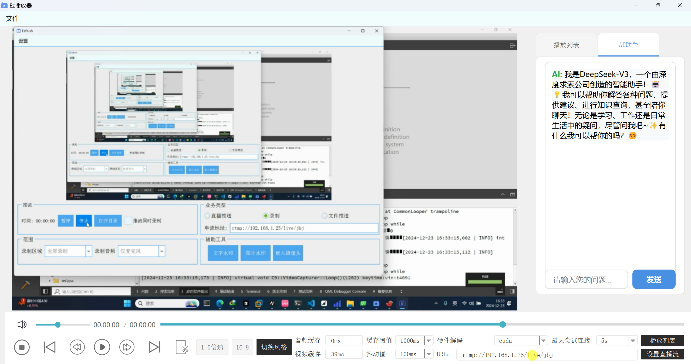

# EzPlayer - 基于FFmpeg的跨平台音视频播放器

[](LICENSE)
[](https://github.com/your-username/EzPlayer)
[](https://www.qt.io/)
[](https://ffmpeg.org/)

## 📖 项目简介

EzPlayer是一个基于Qt框架和FFmpeg库开发的高性能跨平台音视频播放器。该项目采用模块化设计，支持多种音视频格式，具备完整的播放控制功能和智能AI助手。

### 🎥 演示视频
[音视频播放器展示](https://www.bilibili.com/video/BV1PyiXYnEcy?vd_source=55dfba5031ed1a014c1ac576a7abd107)

### 📸 界面预览


## ✨ 主要特性

### 🎯 核心功能
- **多格式支持**: 支持H.264、H.265、VP8、VP9等主流视频编码格式
- **硬件加速**: 支持NVIDIA、Intel QSV、AMD AMF硬件解码
- **流媒体播放**: 支持RTMP、RTSP、HLS等流媒体协议
- **智能同步**: 音视频同步机制，确保播放流畅性

### 🎮 播放控制
- **基础控制**: 播放/暂停、停止、快进/快退
- **进度控制**: 拖动进度条精确定位
- **变速播放**: 0.5x-2.0x倍速播放，保持音调不变
- **音量控制**: 音量调节和一键静音功能

### 📋 高级功能
- **播放列表**: 支持本地文件和网络URL管理
- **实时监控**: 显示缓冲区大小和播放进度
- **截图功能**: 一键截取当前播放画面
- **AI助手**: 集成DeepSeek AI，提供智能交互支持

### 🌐 网络功能
- **延迟追赶**: 智能缓冲控制，自动追赶直播延迟
- **网络监控**: 连接状态检测和异常处理
- **缓存优化**: 可配置的缓冲区大小和抖动区间

## 🏗️ 技术架构

### 核心技术栈
- **GUI框架**: Qt 5.12+
- **音视频处理**: FFmpeg 4.2+
- **音频输出**: SDL2
- **硬件加速**: FFmpeg HWAccel
- **AI集成**: DeepSeek API

### 架构设计
```
┌─────────────────┐    ┌─────────────────┐    ┌─────────────────┐
│   用户界面层     │    │   播放控制层     │    │   解码器层       │
│   (Qt Widgets)  │◄──►│ (IjkMediaPlayer)│◄──►│   (FFmpeg)      │
└─────────────────┘    └─────────────────┘    └─────────────────┘
         │                       │                       │
         ▼                       ▼                       ▼
┌─────────────────┐    ┌─────────────────┐    ┌─────────────────┐
│   显示渲染层     │    │   音视频同步     │    │   硬件加速层     │
│   (Qt)   │    │   (Clock Sync)  │    │  (HW Decoder)   │
└─────────────────┘    └─────────────────┘    └─────────────────┘
```

## 🚀 快速开始

### 环境要求
- **操作系统**: Windows 10+, Ubuntu 18.04+, macOS 10.14+
- **编译器**: MSVC 2017+, GCC 7+, Clang 6+
- **Qt版本**: Qt 5.12 或更高版本
- **FFmpeg**: 4.2.1 或更高版本
- **SDL2**: 2.0.10 或更高版本

### 编译步骤

1. **克隆项目**
```bash
git clone https://github.com/your-username/EzPlayer.git
cd EzPlayer
```

2. **安装依赖**
```bash
# Ubuntu/Debian
sudo apt-get install qt5-default libavcodec-dev libavformat-dev libswscale-dev libsdl2-dev

# Windows (使用vcpkg)
vcpkg install ffmpeg sdl2 qt5-base
```

3. **配置项目**
```bash
# 使用qmake
qmake Ezplayer.pro
make

# 或使用CMake (如果支持)
mkdir build && cd build
cmake ..
make
```

4. **运行程序**
```bash
./Ezplayer
```

## 📁 项目结构

```
EzPlayer/
├── src/                    # 源代码目录
│   ├── homewindow.cpp      # 主窗口实现
│   ├── ijkmediaplayer.cpp  # 播放器核心
│   ├── ff_ffplay.cpp       # FFmpeg播放引擎
│   └── ...
├── include/                # 头文件目录
│   ├── homewindow.h        # 主窗口头文件
│   ├── ijkmediaplayer.h    # 播放器接口
│   └── ...
├── ui/                     # UI文件目录
│   ├── homewindow.ui       # 主窗口界面
│   └── ...
├── assets/                 # 资源文件
├── docs/                   # 文档目录
└── tests/                  # 测试文件
```

## 🔧 配置说明

### 播放器配置
- **缓存设置**: 可调整音频/视频缓冲区大小
- **硬件解码**: 支持多种GPU硬件加速
- **网络超时**: 可配置网络连接超时时间
- **延迟控制**: 直播流延迟追赶参数设置

### 界面配置
- **主题切换**: 支持浅色/深色主题
- **布局调整**: 可自定义界面布局
- **快捷键**: 支持自定义快捷键设置

## 📊 性能特性

- **低延迟**: 优化的缓冲策略，最小化播放延迟
- **高帧率**: 支持60fps高帧率视频播放
- **内存优化**: 智能内存管理，减少资源占用
- **CPU优化**: 硬件加速解码，降低CPU使用率

## 🤝 贡献指南

我们欢迎所有形式的贡献！请查看 [CONTRIBUTING.md](CONTRIBUTING.md) 了解详情。

## 📝 更新日志

### v1.2.0 (2024-12-05)
- ✨ 新增RTMP/RTSP/HLS流媒体支持
- 🔧 优化网络连接和错误处理
- 🎯 新增硬件解码支持
- 🎨 新增深色主题
- ⚡ 优化延迟追赶机制

### v1.1.0 (2024-11-20)
- 🎵 基础音视频播放功能
- 🎮 播放控制功能
- 📋 播放列表管理
- 📸 截图功能
- 🤖 AI助手集成

## 📄 许可证

本项目采用 MIT 许可证 - 查看 [LICENSE](LICENSE) 文件了解详情。

## 🙏 致谢

- [FFmpeg](https://ffmpeg.org/) - 强大的音视频处理库
- [Qt](https://www.qt.io/) - 跨平台GUI框架
- [SDL2](https://www.libsdl.org/) - 音频输出库
- [DeepSeek](https://www.deepseek.com/) - AI助手API

## 📞 联系方式

- **项目主页**: [GitHub](https://github.com/your-username/EzPlayer)
- **问题反馈**: [Issues](https://github.com/your-username/EzPlayer/issues)
- **博客**: [C9程序猿-CSDN博客](https://blog.csdn.net/weixin_50873490?type=blog)

---

⭐ 如果这个项目对您有帮助，请给我们一个星标！
