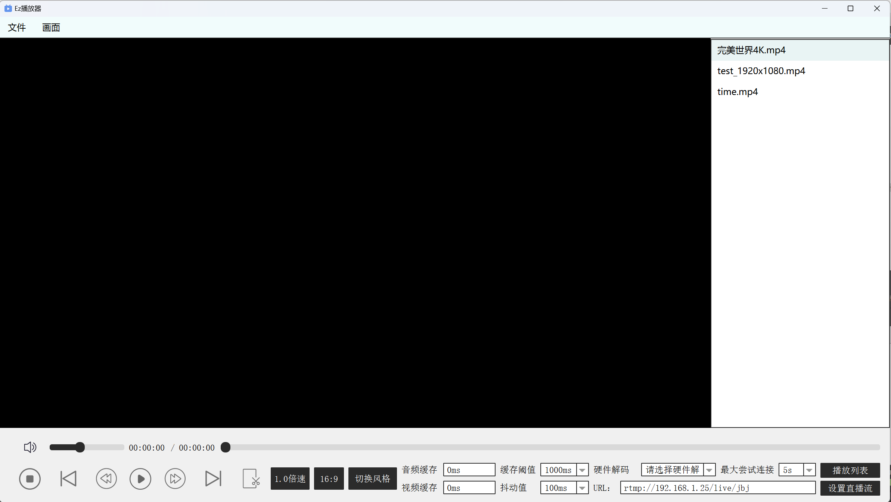

# 项目简介

**v1.1版本**

本项目旨在开发一个基于 FFmpeg 和 SDL 库的音视频播放器 - FFplay。具体详细请查看 **框架设计和分析/**

该播放器将提供以下功能:

1. **播放和暂停**
   - 能够解码和渲染视频和音频数据
2. **停止播放**
   - 提供停止按钮,用户可以完全停止播放
3. **快进快退**
   - 提供快进和快退按钮,让用户可以控制播放进度
4. **拖动播放**
   - 提供进度条控件,用户可以拖动进度条跳转到指定位置
5. **变速播放**
   - 提供速度控制滑块,用户可以调整播放速度
6. **调节声音和一键静音**
   - 提供音量控制滑块,用户可以调整音量大小
7. **播放列表控制**
   - 提供播放列表控件,用户可以选择播放的文件
8. **显示缓存时间和播放进度**
   - 监控音频和视频的缓存情况,并显示缓存进度
9. **截屏**
   - 提供截屏按钮,用户可以在任意时刻捕获当前画面

# V1.2版本更新

支持rtmp拉流播放，检查url格式规范，以及连接失败，突然断开提示。

支持URL最大尝试连接时间。

支持拉流播放高延迟下追赶机制。供用户选择缓冲区大小。

支持选择硬件解码。

支持黑色风格变换。以及网络流相关功能屏蔽。

