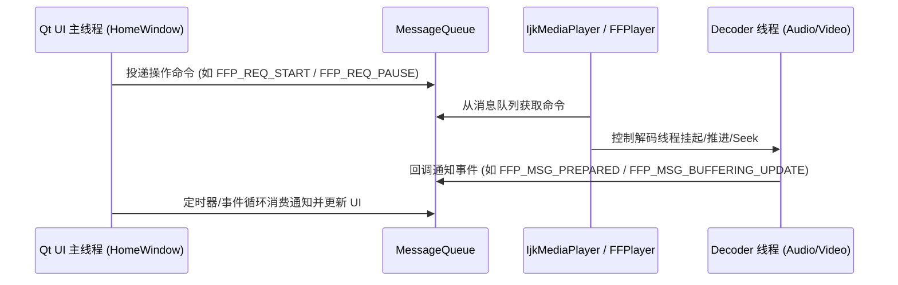

# 系统架构与状态设计

## 1. 架构设计理念：UI 与内核解耦

EzPlayer 采用 **UI 表现层** 与 **播放器核心内核** 深度解耦的经典分层架构设计。核心播放模块不依赖特定的 GUI 控件或窗口环境，使得未来能够无缝移植至 PC（Windows / Linux / macOS）以及移动端（Android / iOS）。

### 核心分层

1. **表现层（Qt GUI Layer - `src/ui` & `src/render`）**：
   - [`HomeWindow`](../src/ui/homewindow.h)：主交互窗口，负责控制栏布局、键盘鼠标事件、进度条联动、全屏与渲染窗口切换。
   - [`Playlist`](../src/ui/playlist.h) / [`MediaList`](../src/ui/medialist.h)：播放列表管理与拖拽打开文件交互。
   - [`OpenGLDisplayWidget`](../src/render/opengldisplaywidget.h) / [`DisplayWind`](../src/render/displaywind.h)：独立的视频画面展示窗口（OpenGL 硬件着色与 QPainter 软解通道）。
2. **中间层（Message & Control Layer - `src/core`）**：
   - [`MessageQueue`](../src/core/messagequeue.h)：基于环形/链表设计的线程安全消息队列，解耦 UI 线程和播放解复用线程。
   - [`CommonLooper`](../src/core/commonlooper.h)：抽象的事件循环基类，提供统一的生命周期与线程调度支持。
   - [`IjkMediaPlayer`](../src/core/ijkmediaplayer.h)：播放器状态机封装层，提供统一的 API 接口。
3. **内核层（FFmpeg 7.1 Engine Layer - `src/core`）**：
   - [`FFPlayer`](../src/core/ff_ffplay.h)：底层的解复用引擎、解码器线程管理（`Decoder`）、Packet/Frame 队列维护。
4. **底层硬件与扩展层（Driver & Network - `src/network` & WebRTC）**：
   - [`RTMPPlayer`](../src/network/rtmpplayer.h) / [`DeepSeekClient`](../src/network/deepseekclient.h)：网络直播流拉取与 AI 对话客户端。
   - WebRTC M153 Audio Engine：高精度时钟音频输出与 3A 信号处理。

---

## 2. 播放器状态机设计

播放器状态的变迁分为两类：
- **主动变迁（实线箭头）**：由外部用户或 UI 触发的 API 调用发起（如播放、暂停、Seek、停止）。
- **被动变迁（虚线箭头）**：由播放器内核完成特定异步任务（如缓冲完成、准备就绪、文件播放完毕 EOF、发生不可恢复错误等）自动推进。

### 状态枚举定义

| 状态 | 对应阶段 | 说明 |
| :--- | :--- | :--- |
| `MP_STATE_IDLE` | 空闲 | 播放器实例刚刚创建或已彻底 DeInit |
| `MP_STATE_INITIALIZED` | 初始化完成 | 数据源（URL / 文件路径）已设置完成 |
| `MP_STATE_ASYNC_PREPARING` | 异步准备中 | 正处于后台线程尝试打开流、解析头部信息中 |
| `MP_STATE_PREPARED` | 准备就绪 | 流信息读取完成，已就绪可随时开始解码输出 |
| `MP_STATE_STARTED` | 正在播放 | 解码器正在解码，音视频时钟正常前进 |
| `MP_STATE_PAUSED` | 已暂停 | 音视频时钟挂起，设备回调静音或挂起 |
| `MP_STATE_STOPPED` | 已停止 | 用户主动停止，所有解码线程与缓冲队列已重置 |
| `MP_STATE_COMPLETED` | 播放完成 | 媒体文件读取到末尾且画面全部呈现完毕 |
| `MP_STATE_ERROR` | 发生错误 | 打开失败、解码异常或网络断开无法恢复 |

---

## 3. 消息队列与线程驱动模型

为了避免解码和音视频重采样阻塞 Qt GUI 主事件循环，EzPlayer 引入了事件驱动的消息机制：

### 关键消息码清单

- `FFP_REQ_START`: 请求启动播放
- `FFP_REQ_PAUSE`: 请求暂停或继续
- `FFP_REQ_SEEK`: 请求进度条跳转（字节/毫秒）
- `FFP_REQ_FORWARD` / `FFP_REQ_BACK`: 快进 / 快退
- `FFP_REQ_SCREENSHOT`: 请求截取当前视频帧
- `FFP_MSG_PLAYBACK_STATE_CHANGED`: 播放状态变更通知
- `FFP_MSG_BUFFERING_UPDATE`: 缓存时间与网络抖动更新通知
