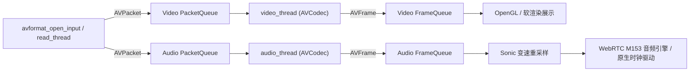

# 播放引擎与音视频同步

## 1. FFmpeg 7.1 解复用与解码流水线

EzPlayer 的媒体播放核心基于 FFmpeg 7.1 实现，遵循经典的 **Demuxer -> PacketQueue -> Decoder -> FrameQueue -> Output** 流水线。



### 关键数据结构

- `PacketQueue`：线程安全的 AVPacket 双向链表，支持 `abort`、`flush`、`put` 与 `get` 操作，并维护序列号 `serial` 用于识别 Seek 后的旧包。
- `FrameQueue`：定长的 AVFrame 环形缓冲区，防止未渲染帧无限堆积占用内存。

---

## 2. 音视频同步机制 (A/V Sync) 与 WebRTC 音频引擎

在音视频播放中，人耳对声音的断续和跳变极其敏感，而对视频画面的轻微抖动相对宽容。EzPlayer 默认采用 **以音频时钟为主时钟 (Audio Master Clock)** 的同步策略，并已全面剥离对传统 SDL2 的依赖，升级为基于原生高精度时钟与 WebRTC M153 音频引擎驱动：

1. **时钟计算**：
   - 音频时钟更新：基于 WebRTC 高精度音频渲染线程驱动与 C++17 `std::chrono` 单调时钟，根据已播放的 PCM 采样点数量精确推算当前的播放时间戳 `audio_pts`，彻底消除了旧版 SDL2 回调由于锁竞争导致的主线程死锁隐患。
   - 视频时钟：每个视频帧携带自身的 PTS（显示时间戳）。
2. **同步差值计算与决策**：
   $$\Delta = \text{PTS}_{video} - \text{Clock}_{audio}$$
   - **视频落后 ($\Delta < -\text{threshold}$)**：需要立即显示甚至跳过（丢弃）该帧，追赶音频进度。
   - **视频超前 ($\Delta > +\text{threshold}$)**：计算需要延迟渲染的时长，等待下一轮渲染定时刷新。
   - **在同步窗口内 ($|\Delta| \le \text{threshold}$)**：正常送往渲染窗口显示。

---

## 3. Sonic 变速不变调处理

常规的音视频加速播放（如 1.5×、2.0×）若直接加速采样播放会导致“花栗鼠音”（音调被拉高）。EzPlayer 引入了开源的 **Sonic 算法库**（[`src/core/sonic.cpp`](../src/core/sonic.cpp) / [`src/core/sonic.h`](../src/core/sonic.h)），实现音频变速不变调：

```cpp
// 1. 初始化 Sonic 采样流
sonicStream audio_speed_convert = sonicCreateStream(target_sample_rate, target_channels);

// 2. 设置播放速率 (0.5x ~ 2.0x)
sonicSetSpeed(audio_speed_convert, speed_factor);

// 3. 将 FFmpeg 重采样后的 PCM 送入 Sonic 处理
sonicWriteShortToStream(audio_speed_convert, (short*)input_buf, samples_count);

// 4. 从 Sonic 读出调整后的数据填充底层音频缓冲区
int out_samples = sonicReadShortFromStream(audio_speed_convert, (short*)output_buf, max_samples);
```

---

## 4. 直播流延迟追赶机制

针对网络直播流或不稳定网络场景，EzPlayer 内置了自适应延迟追赶策略：
- 配置最大容忍缓存时长（默认 `max_cache_duration_ = 1000ms`）与抖动区间（`network_jitter_duration_ = 100ms`）。
- 当缓冲区堆积帧数超过上限时，自动无感知启动 1.5× 微加速播放。
- 缓冲回归正常区间后，自动恢复 1.0× 原速，兼顾低延迟与播放流畅度。

---

## 5. 精确 Seek 与帧截图

- **Seek 机制**：支持进度条拖动与前后快进快退。通过换算目标位置时间戳与流时长比例，调用 `avformat_seek_file` 定位关键帧，并重置包队列序列号 `serial`，清空陈旧帧缓存。
- **截图机制**：接收到 `FFP_REQ_SCREENSHOT` 命令后，渲染刷新时截取当前 `AVFrame`，通过 `sws_scale` 转换为 RGB24/RGB32 像素阵列，封装为 JPEG/PNG 图像保存。
