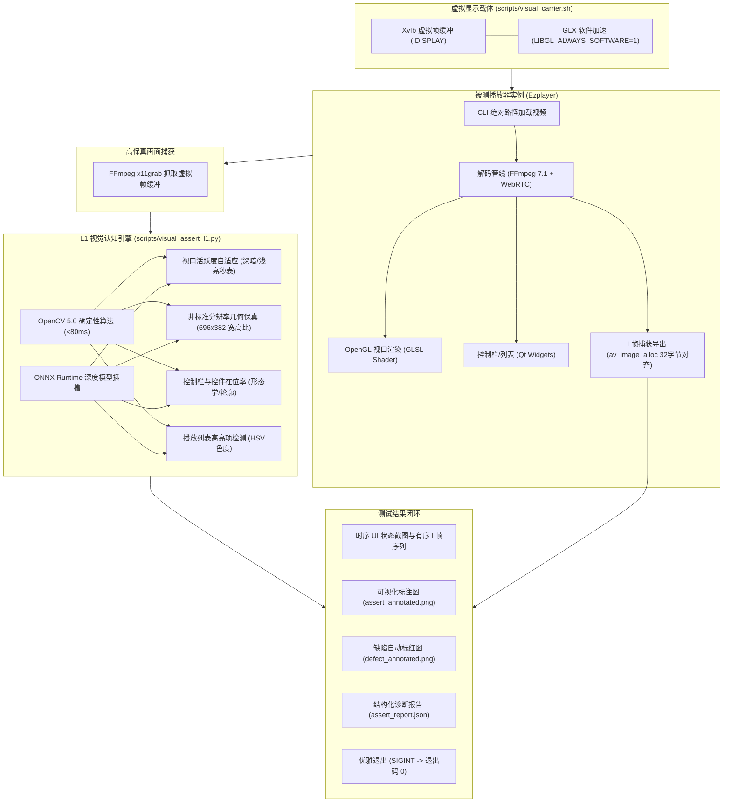

# 06 - 虚拟显示载体、AI 视觉断言与端到端播放测试工作流

---

## 1. 架构演进与设计背景

### 1.1 传统桌面 GUI 自动化测试的困局
在 Linux 远程服务器、SSH 终端或 CI/CD 容器等无物理显示器的环境中，音视频播放器等重度依赖 GUI 与 GPU 渲染的桌面程序常常面临严峻的测试壁垒：
1. **环境缺失与启动崩溃**：Qt 原生应用依赖 X11 或 Wayland Server，无桌面终端直接启动会触发 `QXcbConnection: Could not connect to display` 致命异常并崩溃；
2. **纯离屏（Offscreen）模式的局限**：尽管导出 `QT_QPA_PLATFORM=offscreen` 能够运行无头冒烟测试，但 offscreen 插件无法真实实例化 OpenGL 硬件视口（GLX/EGL），无法测试 YUV420P 片元着色器渲染效果，更无法对窗口物理映射、多步骤人机交互与视觉布局进行保真校验；
3. **传统图像断言（全图像素 Diff）脆弱失效**：传统的全图像素对比（PixelMatch/SSIM）极易因字体内嵌渲染微调、抗锯齿（Anti-Aliasing）差异、时间戳毫秒级递增而大面积误报失败，缺乏真正的“语义级”认知能力。

### 1.2 现代化破局方案：虚拟显示载体 + AI 视觉断言
EzPlayer 创新性地引入了 **“虚拟显示载体（Virtual Display Carrier）”** 与 **“L1/L2 级联视觉断言（Visual Assertion Engine）”** 双轮驱动的现代化端到端测试体系：



---

## 2. 虚拟显示载体核心实现 (Xvfb + GLX + FFmpeg)

### 2.1 载体管理脚本 ([scripts/visual_carrier.sh](../scripts/visual_carrier.sh))
项目封装了全生命周期的虚拟显示管理脚本，兼具交互式调试与一键捕获功能：

```bash
# 1. 一键启动 EzPlayer 并捕获首帧高保真图像 (保存至 test-image/initial_ui.png)
./scripts/visual_carrier.sh capture

# 2. 手动控制虚拟显示服务（用于多步骤长周期交互调试）
./scripts/visual_carrier.sh start     # 启动后台持久化 Xvfb 服务
./scripts/visual_carrier.sh status    # 查看当前虚拟屏幕状态与进程
./scripts/visual_carrier.sh stop     # 平稳停止虚拟显示服务
```

### 2.2 虚拟屏幕与 OpenGL 插件锁定配置
为确保 Qt 框架在 Xvfb 无头环境下正确加载 GLX 扩展与 XCB 插件，运行环境必须严格注入如下环境变量：

```bash
# 锁定 Qt 顶层插件与平台插件搜索路径
export QT_PLUGIN_PATH="/root/project/qt-dev-tools/qt5/usr/lib/x86_64-linux-gnu/qt5/plugins"
export QT_QPA_PLATFORM_PLUGIN_PATH="/root/project/qt-dev-tools/qt5/usr/lib/x86_64-linux-gnu/qt5/plugins/platforms"
export QT_QPA_PLATFORM=xcb
# 强制开启 Mesa 软件栅格化 OpenGL 加速（免物理显卡驱动）
export LIBGL_ALWAYS_SOFTWARE=1

# 启动 Xvfb 虚拟屏幕（必须显式开启 +extension GLX +render）
Xvfb :125 -screen 0 1280x720x24 +extension GLX +render -noreset -nolisten tcp &
```

---

## 3. L1 确定性视觉断言引擎 ([scripts/visual_assert_l1.py](../scripts/visual_assert_l1.py))

### 3.1 架构与技术栈
视觉断言引擎采用 Python 3 + OpenCV 5.0 + ONNX Runtime (ORT) 架构，定位为 **超低开销（< 100ms）确定性断言**：

| 断言规则项 | 核心算法与特征提取 | 判据与阈值 |
|---|---|---|
| **`resolution_check`** | 图像矩阵几何尺寸核验 | 宽度 $\ge 800$ 且 高度 $\ge 500$（标准 1280x720 视窗） |
| **`viewport_health`** | 灰度均值、方差与拉普拉斯边缘能量算子 | • 纯白死屏防御：$mean > 240 \land std < 10 \land lap < 5$ 判为 FAIL；<br>• 亮色活跃视频自适应：$mean > 150 \land (std > 20 \lor lap > 30)$ 判为 PASS；<br>• 深色视口自适应：$mean \le 150$ 判为 PASS。 |
| **`aspect_ratio_fidelity`** | 视口内容最大外接矩形拟合与理论长宽比比对 | 测量长宽比与原始视频比例（如 $696 / 382 \approx 1.8220$）误差 $\le 5\%$（实测误差 $< 0.7\%$） |
| **`control_bar_presence`** | 底部区域 Canny 边缘轮廓提取 + 水平形态学核轨道检测 | 有效图标特征数 $\ge 3$ 且 包含水平进度条细长轨道 |
| **`playlist_panel`** | HSV 色度空间浅蓝色（`#e8f4fe`）选中条像素统计与对比度 | 激活高亮像素数 $\ge 500$（实测播放态稳定达到 8000+ 像素） |
| **`onnx_model_slot`** | ONNX Runtime 可插拔深度模型推理插槽 | 当放置 `models/ui_detector.onnx` 时自动开启目标检测与轻量 OCR |

### 3.2 缺陷自动可视化标红与 JSON 诊断报告
一旦任何断言项未达预期，引擎将自动生成：
1. **`defect_annotated.png`**：自动在缺陷区域绘制半透明红色遮罩蒙版（Alpha=0.35）与红色高亮告警边框，并印有 `[DEFECT] <rule_name>` 警示标签；
2. **`assert_report.json`**：导出机器可读的结构化诊断报告，包含时间戳、各指标原始数值及排错建议（`remedy`）；
3. **L2-VLM 唤醒看门狗**：输出提示信息，建议自动调度多模态大模型进行深度语义因果分析。

---

## 4. 端到端音视频播放测试流水线

### 4.1 核心播放引擎增强：命令行绝对路径直接加载
为了支持自动化测试流水线无缝注入待测视频文件，播放器主入口与主视窗提供了直接接收文件路径并自动加载播放的能力：
- **公共接口**：[`src/ui/homewindow.h`](../src/ui/homewindow.h) 导出 `openPath(const QString& filePath)`；
- **命令行传参**：[`src/main.cpp`](../src/main.cpp) 解析 `argv[1]`，在主视窗就绪后通过 `QTimer::singleShot(400, ...)` 自动触发 `OnAddFileAndPlay`。

### 4.2 过程关键 I 帧受控导出管线
- **触发机制**：通过环境变量 `export EZPLAYER_DUMP_IFRAME_DIR="<path>"` 激活；
- **现代 FFmpeg 7.1 判定**：在 `HomeWindow::OutputVideo` 渲染主线程中通过 `pict_type == AV_PICTURE_TYPE_I || (flags & AV_FRAME_FLAG_KEY)` 精准捕获；
- **动态防抖去重**：设定 `std::abs(current_pts_ms - last_dumped_iframe_pts_) >= 500`，杜绝解码缓冲区同一时间戳关键帧重复落盘；
- **按 PTS 严格单调命名**：文件名格式为 `iframe_%04d_pts%05lldms.png`。

### 4.3 专项测试流水线矩阵

#### 流水线 A：`synctime.mp4` 基础播放测试 ([scripts/test_synctime_playback.sh](../scripts/test_synctime_playback.sh))
- **视频属性**：时长 40 秒，标准 640x360 分辨率，稀疏关键帧（每 10 秒 1 帧）；
- **执行时间**：观察 32 秒播放；
- **产物闭环**：在 `test-image/synctime/` 导出 4 个完整 I 帧（PTS 0s, 10s, 20s, 30s）与 4 张时序 UI 快照。

#### 流水线 B：`time.mp4` 高频密集 I 帧与非标准宽高比测试 ([scripts/test_time_playback.sh](../scripts/test_time_playback.sh))
- **视频属性**：时长 3 分钟（已使用 FFmpeg `-c copy` 极速无损流复制从 22 分钟裁剪，体积从 42MB 降至 5.7MB），`696 x 382` 非标准奇偶分辨率，高反差浅白底色“在线秒表”画面；
- **执行时间**：观察 18 秒播放；
- **产物闭环**：在 `test-image/time/` 导出 5 个密集 I 帧（PTS 70ms, 790ms, 5470ms, 9830ms, 14470ms），并成功断言 696x382 宽高比误差仅 0.68%，总时长自适应解析为 `00:03:00`。

---

## 5. 工程避坑实战：696 宽度 SIMD 32 字节内存跨距踩堆深度剖析

### 5.1 事故现场
在对 `time.mp4` 进行密集 I 帧提取时，程序频繁抛出致命堆崩溃并 Dump Core：
```text
malloc(): corrupted top size
bash: line 9: 2231190 Aborted (core dumped) ./build/Ezplayer test-video/time.mp4
```

### 5.2 根因定位与数学机理
原 I 帧导出代码直接使用 `QImage` 分配目标内存，并将其指针传入 FFmpeg 的 `sws_scale` 进行 RGB24 格式转换：
```cpp
// 【危险代码】：QImage 分配的行内存仅满足 4 字节对齐，末尾无 padding
QImage img(width, height, QImage::Format_RGB888);
uint8_t* dst_data[4] = {img.bits(), nullptr, nullptr, nullptr};
int dst_linesize[4]  = {static_cast<int>(img.bytesPerLine()), 0, 0, 0};
sws_scale(sws_ctx, f->frame->data, f->frame->linesize, 0, height, dst_data, dst_linesize);
```
- 对于 `synctime.mp4`：$width = 640$，单行字节数 $640 \times 3 = 1920$ 字节，正好是 16 与 32 的整数倍（$1920 / 32 = 60$）；
- 对于 `time.mp4`：$width = 696$，单行字节数 $696 \times 3 = 2088$ 字节，$2088 / 32 = 65.25$，**不是 16 或 32 的倍数**！
- FFmpeg 的 `swscale` 在 x86_64 平台上重度使用 AVX2 / SSE2 向量化指令加速每行的 RGB 打包写入（每次写入 16 或 32 字节）。当写入行尾最后几个像素时，向量写指令直接**越界写穿了行缓冲区边界**，踏平了后续内存中 glibc 堆块头（Top Chunk Size）。在下一次任意线程调用 `malloc` 时，glibc 校验到堆头被毁，立即触发 `malloc(): corrupted top size` 崩溃！

### 5.3 标准安全修复方案
在 [`src/ui/homewindow.cpp`](../src/ui/homewindow.cpp) 中引入 `<libavutil/imgutils.h>`，使用 FFmpeg 官方推荐的 `av_image_alloc` 并显式声明 **32 字节对齐**：

```cpp
// 【安全规范代码】：显式按 32 字节对齐分配，自带行尾 SIMD 安全 padding
uint8_t* dst_data[4] = {nullptr};
int dst_linesize[4]  = {0};
int alloc_ret = av_image_alloc(dst_data, dst_linesize, width, height, AV_PIX_FMT_RGB24, 32);
if (alloc_ret >= 0) {
    sws_scale(sws_ctx, f->frame->data, f->frame->linesize, 0, height, dst_data, dst_linesize);
    QImage img(dst_data[0], width, height, dst_linesize[0], QImage::Format_RGB888);
    img.copy().save(QString::fromUtf8(filename));
    av_freep(&dst_data[0]);
}
```
经过修复后，非标准分辨率图像转换零崩溃，吞吐极其稳定。

---

## 6. 验证与操作命令总览

| 操作目标 | 命令 | 预期耗时与结果 |
|---|---|---|
| **一键全量回归闭环** | `./scripts/agent_verify.sh` | 约 5 秒，构建 + 14 项 CTest + Offscreen 冒烟 + Xvfb 视觉抓图全通过 |
| **synctime 端到端播放测试** | `./scripts/test_synctime_playback.sh` | 约 35 秒，提取 4 个 I 帧并完成 L1 视觉判定通过 |
| **time 端到端播放测试** | `./scripts/test_time_playback.sh` | 约 22 秒，提取 5 个密集 I 帧并完成 696x382 宽高比断言通过 |
| **虚拟视窗首帧捕获** | `./scripts/visual_carrier.sh capture` | 约 3 秒，生成 `test-image/initial_ui.png` |
| **执行 L1 智能视觉断言** | `python3 scripts/visual_assert_l1.py --image <png> --video-type time` | 约 80 毫秒，输出结构化报告与标红图 |
| **源码格式自动合规治理** | `./scripts/run-clang-format.sh` | 约 1 秒，就地修复全工程 C++17 格式 |
