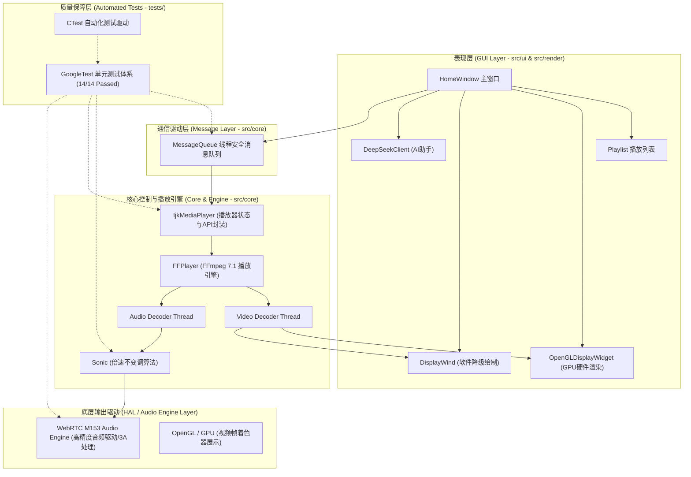

# EzPlayer 官方工程与设计文档

欢迎查阅 **EzPlayer** 音视频播放器核心工程与技术设计文档。本项目采用 C++17、Qt 5.15、FFmpeg 7.1 与 WebRTC M153 音频引擎构建，参考 ijkplayer 经典架构并完成了：
1. **现代 CMake + Ninja 构建与 `src/` 模块化目录解耦**；
2. **Conan 2.x 依赖包管理与 `spdlog` 高性能日志系统升级**；
3. **WebRTC M153 音频底层与音视频采集模块集成（彻底剥离 SDL2）**；
4. **基于 GoogleTest + CTest 的 14 项全自动单元测试与无头冒烟自检闭环**。

---

## 📚 文档目录索引

| 序号 | 文档名称 | 核心内容概要 |
| :--- | :--- | :--- |
| **01** | [系统架构与状态设计](01-architecture-and-design.md) | UI 与内核解耦设计、播放器状态机模型、多线程消息循环与事件驱动机制 |
| **02** | [播放引擎与音视频同步](02-playback-engine-and-sync.md) | FFmpeg 7.1 解复用、WebRTC 音频引擎、PTS 时钟同步、Sonic 变速不变调与抖动延迟追赶 |
| **03** | [视频渲染与 OpenGL 硬件加速](03-rendering-and-opengl.md) | QOpenGLWidget + GLSL Shader 硬件渲染 YUV420P、纹理更新与软硬件渲染动态切换 |
| **04** | [现代 CMake + Ninja 构建与测试指南](04-modern-cmake-and-ninja-guide.md) | Conan 2.x 包管理、Target 目标模型、自动化 Qt 工具链、Presets 测试预设与 GoogleTest 自动化测试 |
| **05** | [扩展模块与周边能力](05-extension-modules.md) | DeepSeek-V3 对话助手集成、spdlog 高性能日志系统、WebRTC 音视频采集与 RTMP 模块 |

---

## 🧭 项目全景架构



---

## 📁 模块化项目工程目录树

经过深度架构治理，本项目源码全面重构并归入 `src/` 模块化目录，测试套件归入 `tests/`，历史工程配置归档至 `legacy/`：

```text
EzPlayer/
├── CMakeLists.txt              # 现代 CMake 顶层目标化构建描述
├── CMakePresets.json           # 官方构建与测试预设 (configure / build / test)
├── conanfile.txt               # Conan 2.x 声明式第三方依赖清单 (spdlog, gtest)
├── conan/                      # Conan 构建 Profile 配置
│   └── profiles/linux-default  # Linux 平台 GCC 11 + C++17 + Ninja Profile
├── build.sh                    # Linux 一键构建、Conan 自动探测与测试运行脚本
├── run.sh                      # Linux 启动脚本 (优先检测 build/Ezplayer 并注入平台插件)
├── cmake/                      # 自定义 CMake 模块
│   └── FindFFmpeg.cmake        # FFmpeg 7.1 自动探测与 Imported Target 封装
├── src/                        # 核心源代码主目录（模块化分层治理）
│   ├── main.cpp                # 应用程序主入口与全局 spdlog 日志系统初始化
│   ├── core/                   # 核心播放内核与音视频调度模块
│   │   ├── ijkmediaplayer.cpp/h  # 播放器顶层封装层 (状态机管理与对外控制 API)
│   │   ├── ff_ffplay.cpp/h     # FFmpeg 播放引擎 (解复用、音视频解码与 PTS 时钟同步)
│   │   ├── ff_ffplay_def.cpp/h # 播放内核核心数据结构 (帧队列、PacketQueue 等)
│   │   ├── messagequeue.cpp/h  # 跨线程安全消息队列 (支持超时等待与精准丢弃)
│   │   ├── commonlooper.cpp/h  # 抽象事件循环基类 (统一线程生命周期管理)
│   │   ├── sonic.cpp/h         # Sonic 倍速不变调处理库
│   │   ├── imagescaler.cpp/h   # 图像像素格式转换与软件缩放 (swscale)
│   │   ├── ijksdl_timer.cpp/h  # 高精度计时器抽象封装
│   │   ├── mediabase.cpp/h     # 媒体基础数据类型与时钟定义
│   │   ├── ffmsg.h             # 播放器核心消息枚举与指令常量
│   │   └── ff_fferror.h        # 统一播放错误码定义
│   ├── render/                 # 视频渲染与显示模块
│   │   ├── opengldisplaywidget.cpp/h # 基于 QOpenGLWidget+GLSL Shader 的 YUV 硬件着色器
│   │   └── displaywind.cpp/h/ui      # 软件绘制窗口 (QPainter 软解备份渲染通道)
│   ├── ui/                     # 表现层与 GUI 交互界面模块
│   │   ├── homewindow.cpp/h/ui # 主交互窗口 (控制栏、进度条、快捷键及布局调度)
│   │   ├── playlist.cpp/h/ui   # 播放列表 UI 组件与交互事件
│   │   ├── medialist.cpp/h     # 播放列表元数据管理与本地持久化
│   │   ├── customslider.cpp/h  # 自定义高精度可点击跳转滑动条控件
│   │   ├── screenshot.cpp/h    # 视频帧一键截图与 JPEG 存储功能
│   │   ├── toast.cpp/h         # 非模态渐变通知提示气泡 (分级状态通知)
│   │   └── urldialog.cpp/h/ui  # 网络流媒体 URL 导入对话框
│   ├── network/                # 网络流媒体与智能扩展服务模块
│   │   ├── rtmpplayer.cpp/h    # RTMP 拉流模块与自动断线重连器
│   │   ├── rtmpbase.cpp/h      # RTMP 底层网络库封装
│   │   └── deepseekclient.cpp/h/ui # DeepSeek-V3 对话助手客户端
│   └── utils/                  # 基础设施与通用工具模块
│       ├── globalhelper.cpp/h  # 全局通用辅助函数与资源宏
│       └── log/                # 现代高性能日志系统
│           ├── logger.cpp/h    # 基于 spdlog 的多 Sink (控制台彩色+滚动文件) 日志实现
│           └── easylogging++.h # 向后兼容适配层 (支持 LOG(LEVEL) << ... 流式语法)
├── tests/                      # GoogleTest 自动化单元测试套件 (14/14 Passed)
│   ├── CMakeLists.txt          # 单元测试构建配置 (接入 Conan GTest / CTest 自动发现)
│   ├── test_main.cpp           # 测试独立入口与日志初始化 (规避静态库符号冲突)
│   ├── test_message_queue.cpp  # MessageQueue 消息队列并发、超时与生命周期单测
│   ├── test_sonic_speed.cpp    # Sonic 音频倍速算法重采样与缩放单测
│   ├── test_common_looper.cpp  # CommonLooper 异步事件循环线程生命周期单测
│   ├── test_sync_queues.cpp    # A/V 同步队列 (PacketQueue / FrameQueue) 边界单测
│   └── test_webrtc_avcapture.cpp # WebRTC 音视频采集与设备枚举生命周期单测
├── scripts/                    # 自动化与 Agent 运维脚本目录
│   ├── agent_verify.sh         # 一键编译、全量单测与无头冒烟自动化验证闭环脚本
│   ├── conan-install.sh        # Conan 2.x 依赖自动安装与 CMake Toolchain 生成脚本
│   ├── check-clang-format.sh   # 代码格式合规性检查脚本
│   └── run-clang-format.sh     # 代码自动就地格式化脚本
├── legacy/                     # 历史遗留构建与工程文件归档
│   ├── Ezplayer.pro            # 历史 qmake 工程描述
│   ├── deps_config.pri         # 历史环境依赖路径配置
│   ├── build.bat               # Windows 历史构建批处理脚本
│   └── Ezplayer.sln            # 历史 Visual Studio 解决方案
├── docs/                       # 官方技术文档库与架构指南
├── res/                        # 图标、字库及 QSS 样式静态资源
├── resource.qrc                # Qt 资源集合描述文件
├── AGENTS.md                   # 面向 AI Coding Agent 的工程规约、拓扑与避坑指南
└── CLAUDE.md                   # 软链接指向 AGENTS.md (多 Agent 工具链兼容)
```

---

## ⚡ 快速跳转

- **想了解现代构建、Presets 与自动化单测？** 请参考 [04-modern-cmake-and-ninja-guide.md](04-modern-cmake-and-ninja-guide.md)。
- **想了解音画同步、解码与倍速播放？** 请参考 [02-playback-engine-and-sync.md](02-playback-engine-and-sync.md)。
- **想了解 GPU 硬件着色与渲染模式切换？** 请参考 [03-rendering-and-opengl.md](03-rendering-and-opengl.md)。
- **想了解状态机模型与消息队列流转？** 请参考 [01-architecture-and-design.md](01-architecture-and-design.md)。
- **想了解 AI 对话助手与日志扩展？** 请参考 [05-extension-modules.md](05-extension-modules.md)。
