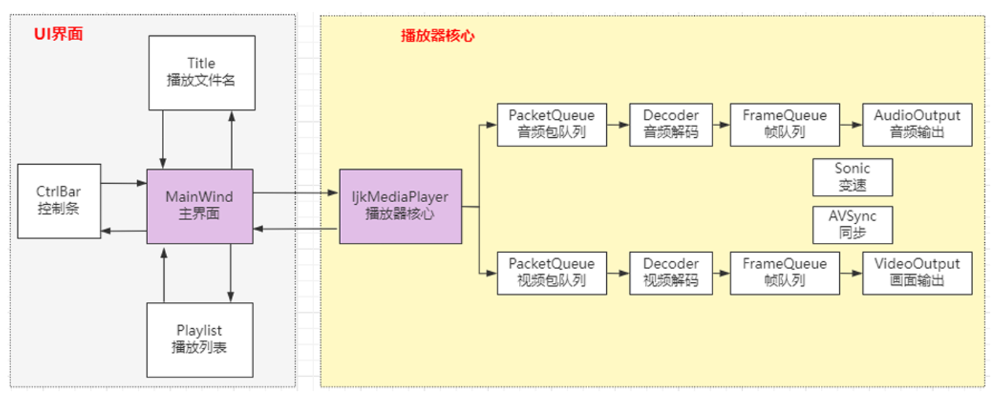
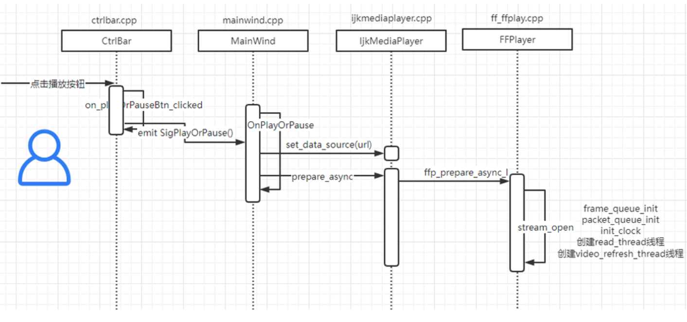
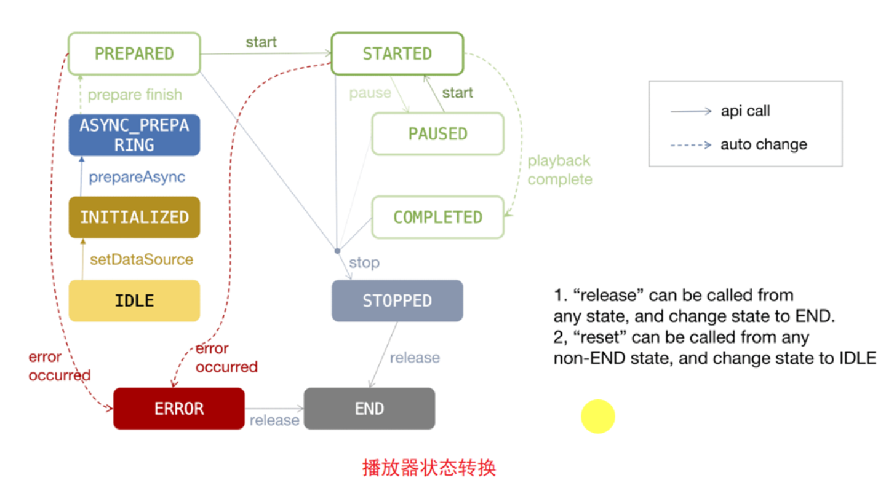
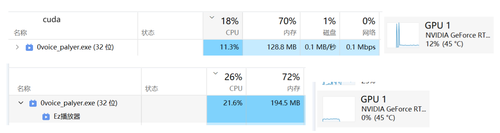

# Ezplay

# 架构

播放器项目架构采用UI和播放器核心分离的模式，从而方便将播放器适配到PC（Win/Ubuntu/MAC）、Android、IOS端。





## 播放器状态设计

注意图中的线条： ● ● 实线箭头连接的状态变化通过  API  调⽤完成，  虚线箭头连接的状态变化是通过  播放器内部执⾏完特定任务或者发⽣错误  ⽽⾃动发⽣的状态 变化。




# v1.0功能实现

### 播放器核心功能实现

**Easylogging日志使用**

[easylogging++日志库使用手册\_easyloggingpp-CSDN博客](https://blog.csdn.net/yang1fei2/article/details/128682604)

[Easylogging++的使用及扩展 - 二次元攻城狮 - 博客园](https://www.cnblogs.com/timefiles/p/UseEasyloggingpp.html)

[Easylogging介绍和简单使用-CSDN博客](https://blog.csdn.net/woshichenweixian/article/details/77018452)


**播放和暂停实现**

```
入口api：HomeWindow::on_playOrPauseBtn_clicked()
```

1.更改ui层播放/暂停，如果上下文关闭 重新申请上下文

```
bool HomeWindow::play(std::string url)
```

2.先清空队列中的播放/暂停消息再投递信号到消息队列，这样做的好处是防止消息队列堆积播放和暂停。
3.消息队列处理：
case FFP_REQ_PAUSE: 
暂停：更新暂停标志位
继续播放：更新 frame_timer 和音视频时钟。
还有暂停时step播放一帧 此功能暂未实现 null

**停止播放实现**

```
入口api：HomeWindow::stop()
```

关闭所有音视频相关的上下文，比如：ijkPlay对象，消息队列 显示控件

**快进快退播放实现**

```
两者实现基本一致，快退MP_SEEK_STEP * -1
入口api：
void HomeWindow::on_forwardFastBtn_clicked()
void HomeWindow::on_backFastBtn_clicked()
MP_SEEK_STEP  10  快进10s单位
```

1.seek_req标志位置为1 清空并投递信号 FFP_REQ_FORWARD

**2.获取当前播放pos ，不管是以时间还是字节快进，项目都是以字节方式处理。最终调用stream_seek，设置标志位**

**3.read_thread处理seek操作，纠正界限，四舍五入seek值  ，快进具体处理avformat_seek_file**

4.seek完毕  更新播放状态

```
ffplayer_->ffp_forward_to_l(msg->arg1);
ffp_forward_or_back_to_l  转换成字节处理快进
stream_seek  标记 seek_req =1和flag
if (seek_req)
```

**拖动播放实现**

1.设置进度条区间最大6000 最小0，设置进度条值变更槽函数连接。

2.计算当前进度条的系数占比，通过系数和文件总字节数估算出大致seek位置。唯一的投递（先删除相同再投递） FFP_REQ_SEEK

3.seek_pos转化成ms，验证seek_pos是否在start和end区间。合理则调用stream_seek，上述提到过设置标志位。

```
入口api：
HomeWindow::InitSignalsAndSlots()
ui->playSlider->setMinimum(0);
槽函数：
HomeWindow::on_playSliderValueChanged(int value)
HomeWindow::seek(int cur_valule)
IjkMediaPlayer::ijkmp_seek_to(long msec)

FFPlayer::ffp_seek_to_l(long msec)
```

**调节声音实现**

1.设置进度条区间最大128 最小0（ffplay设计），连接值变动槽函数

2.更改核心变量audio_volume

3.在sdl_audio_callback中处理音频的音量，is->audio_volume决定输出的音量

```
入口api：
HomeWindow::InitSignalsAndSlots()
HomeWindow::on_volumeSliderValueChanged(int value)
HomeWindow::on_updateCurrentPosition   ui进度条位置调整
    
最终底层调用
FFPlayer::ffp_set_playback_volume(int value)

音量最大播放
memcpy(stream, (uint8_t *)is->audio_buf + is->audio_buf_index, len1);
区间内播放：
memset(stream, 0, len1);
if ( ！is_muted  &&is->audio_buf)
SDL_MixAudio(stream, (uint8_t *)is->audio_buf + is->audio_buf_index, len1, is->audio_volume);

功能扩展：一键禁音 stream为null即可
时间：2024年11月9日 已实现一键禁音
```

**变速播放功能实现**

**参考**

[Qt/C++音视频开发66-音频变速不变调/重采样/提高音量/变速变调/倍速播放/sonic库使用 - 飞扬青云 - 博客园](https://www.cnblogs.com/feiyangqingyun/p/18004357)

[使用sonic进行音频倍速播放_使用sonic库处理音频-CSDN博客](https://blog.csdn.net/qq_40170041/article/details/127727153?ops_request_misc={"request_id"%3A"79115751-E262-4FE3-9413-9FD4C1D984AD"%2C"scm"%3A"20140713.130102334.."}&request_id=79115751-E262-4FE3-9413-9FD4C1D984AD&biz_id=0&utm_medium=distribute.pc_search_result.none-task-blog-2~all~sobaiduend~default-1-127727153-null-null.142^v100^pc_search_result_base9&utm_term=sonic库&spm=1018.2226.3001.4187)

Qt调用sonic库基本步骤：

- 创建对象 sonicCreateStream，传入采样率和通道。
- 设置倍速 sonicSetSpeed，还可以设置音调sonicSetPitch、设置语速sonicSetRate等。
- 计算out采样点 写入数据 sonicWriteShortToStream，将收到的可以直接播放的pcm音频数据传入。
- 计算 out buff的一帧字节占用量，申请内存。
- 取出数据 sonicReadShortFromStream，将取出的数据再发给qaudiooutput播放即可。

```
// 重新计算采样点 总字节/通道*采样点数
int actual_out_samples = is->audio_buf_size /
                         (is->audio_tgt.channels * av_get_bytes_per_sample(is->audio_tgt.fmt));
//重新计算buff
num_samples =  sonicSamplesAvailable(is->audio_speed_convert);
// 2通道  目前只支持2通道的
out_size = (num_samples) * av_get_bytes_per_sample(is->audio_tgt.fmt) * is->audio_tgt.channels;
av_fast_malloc(&is->audio_buf1, &is->audio_buf1_size, out_size);
                
```

业务实现：

1.ui层获取上次速率，在基础增量0.5 最大2.0。并设置音频变速标志位和变速值。

2.在sdl_audio_callback 处理，实现soinc调速。

```
入口api：HomeWindow::on_speedBtn_clicked()
FFPlayer::ffp_set_playback_rate(float rate) 设置音频变速标志位和变速值。
```

### 用户体验相关功能实现

- 播放列表控制

**核心逻辑消息传递：选中文件SigAddFile->投递SigPlay ->播放HomeWindow::play**

> 涉及类：
> class MediaList : public QListWidget       此类是用于ui交互，方便用户打开文件夹选择。拿到url投递SigAddFile
> class Playlist : public QWidget		  此类是播放列表核心，管理和控制url播放。最终投递SigPlay
>
> class HomeWindow   				核心：播放和暂停

1.MediaList::Init()  右击播放列表，**添加文件/移除 action** ...   **最终emit SigAddFile**
2.Playlist::Init()   核心：**拿到url，设置list.item的数据/名称/提示，绑定对应消息play，等待用户产生播放事件。**

特别功能：支持历史播放名单，支持拖拽文件播放，单机选择双击选中播放，上一集下一级快速播放

3.HomeWindow层 **播放控制实现核心：HomeWindow::play，HomeWindow::stop**


- 显示缓存时间 播放进度显示

```
改进为定时器0.5s刷新一次ui显示
void HomeWindow::onTimeOut()
{
    if(mp_) {
        // ui获取缓存的值
         reqUpdateCacheDuration();
        // ui更新滑动条和播放时长
         reqUpdateCurrentPosition();
    }
}
```

- 截屏

```
1.点击截屏
2. 投递消息FFP_REQ_SCREENSHOT 
3.处理 ffp_screenshot_l((char *)msg->obj) 标志位req_screenshot_ = true
4.video_refresh 刷新的时候 根据标志位是否截屏screenshot(AVFrame *frame) -> 主要实现：SaveJpeg
```


# v1.1更新

1.重新设计播放速度解耦

**2.直播流高延迟追赶机制**

在网络延迟较高的时候，会造成队列积累多帧。这时候要需要自动进行倍速播放，降低实时延迟。恢复正常后进入正常播放

```
api: FFPlayer::ffp_frameq_cache(int value)
1 设置最大缓存 500 抖动值 200
2发现超过缓存 + 抖动值 投递消息快播2速
3 发现低于缓存 - 抖动值恢复，投递消息1倍速
```

3.导入文件才有音频输出，正常播放历史列表无声音。已解决

[SDL播放音频的时候发现SDL_OpenAudioDevice打开一直失败_audio2create() failed at open.-CSDN博客](https://blog.csdn.net/shixin_0125/article/details/107862715)

4.进度条时间点未更新，缓存队列ui显示值未更新

重新设计ui响应，使用定时器每0.5s刷新一次ui布局。

5.嵌入小图标不清晰解决方案

 https://blog.csdn.net/InTimeTravel/article/details/111880479

6.修复倍速播放时，快进和快退bug。 


# v1.2预计更新

**硬件解码**

[播放器开发之ffmpeg 硬件解码方案-CSDN博客](https://blog.csdn.net/weixin_50873490/article/details/143836492?spm=1001.2014.3001.5501)




# 参考

- 在线转换图标网站 https://convertio.co/zh/

- [Qt 设置应用程序图标_qt设置图标_Qt程序员的博客-CSDN博客](https://blog.csdn.net/hw5230/article/details/129447066)

- [QT解决报错registered using qRegisterMetaType()_qregistermetatype 报错-CSDN博客](https://blog.csdn.net/Larry_Yanan/article/details/127686354)

- [Qt开发----如何发布Release版本（生成exe文件）_qt release_冬瓜~的博客-CSDN博客](https://blog.csdn.net/weixin_44793491/article/details/118307151)


